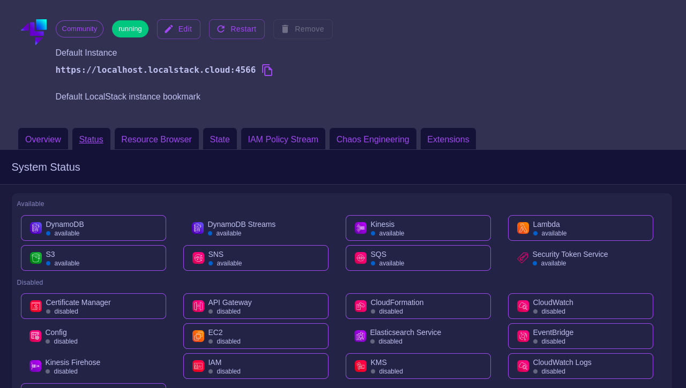

# Docker for Big Data
Veja [readme in English](./readme_english.md)

## Objetivo do Projeto
O projeto "docker-4-big-data" visa criar um ambiente Docker para orquestrar e processar Big Data de forma eficiente, em um **ambiente on-premise/desenvolvimento**. A utilização de **containers Docker** garante a portabilidade e a escalabilidade, enquanto o uso de ferramentas como **Apache Airflow** para orquestração de workflows, **Apache Spark** para processamento de dados, **PostgreSQL** para armazenamento, e **LocalStack** para simulação de serviços AWS, cria um ambiente robusto para automação e manipulação de grandes volumes de dados. Esse ambiente está configurado para ser executado localmente, possibilitando um fluxo de dados eficiente, com ênfase em testes e desenvolvimento em um contexto de **data engineering**.

## Ferramentas Utilizadas
- **Apache Airflow** (versão 2.10.4 com Python 3.12): Orquestração de workflows.
- **Apache Spark** (imagem `bitnami/spark:3.5.4`): Processamento distribuído de dados.
- **PostgreSQL** (imagem `postgres:17.2`): Banco de dados relacional utilizado no lugar do banco SQLite padrão do Airflow, proporcionando maior capacidade e escalabilidade para o armazenamento de metadados. Também usado para consultar dados via queries.
- **LocalStack** (imagem `localstack/localstack:4.0.3`): Simulação de serviços AWS, como **S3**, **SNS**, **SQS**, **DynamoDB**, **Lambda** e **API Gateway**, permitindo a emulação de um ambiente AWS local para testes e desenvolvimento de soluções.
- **Python**: Linguagem principal utilizada para scripts e dependências, especialmente no Airflow.
- **Bash**: Linguagem utilizada para o script de inicialização `docker-entrypoint.sh` e no `Makefile`.

## Imagens e Versões Utilizadas
- **Apache Airflow**: `apache/airflow:2.10.4-python3.12`
- **Apache Spark**: `bitnami/spark:3.5.4`
- **LocalStack**: `localstack/localstack:4.0.3`
- **PostgreSQL**: `postgres:17.2`

## Comandos Docker
Os comandos para executar ou desmontar os contêineres estão definidos no `Makefile`, tornando a utilização do Docker mais prática. O usuário não precisa interagir com os comandos originais do Docker diretamente. Os principais comandos são:

- **`make build`**: Constrói os contêineres definidos no `docker-compose.yml`.
  ```
  make build
  ```
- **`make destroy`**: Interrompe os contêineres e remove volumes.
  ```
  make destroy
  ```
- **`make start`**: Inicializa os contêineres, garantindo que o Airflow Webserver esteja disponível.
  ```
  make start
  ```
- **`make stop`**: Interrompe os contêineres e remove os recursos associados.
  ```
  make stop
  ```

Esses comandos automatizam o processo e facilitam a implementação e execução do projeto.

## Estrutura do Projeto
O projeto segue a seguinte estrutura de diretórios:

```
docker-4-big-data/
├── containers/
|   ├── airflow/
|   │   ├── dags/
|   │   ├── logs/
|   │   ├── .env
|   │   ├── docker-entrypoint.sh
|   │   ├── Dockerfile
|   │   └── requirements.txt
|   ├── localstack/
|   │   ├── data/
|   │   |   ├── cache/
|   │   |   ├── lib/
|   │   |   ├── logs/
|   │   |   └── tmp/
|   │   └── .env
|   ├── postgres/
|   │   └── .env
|   ├── postgres-airflow/
|   │   └── .env
|   └── spark/
|       ├── configs/
|       |   ├── spark-master.env
|       |   └── spark-worker.env
|       └── .env
├── data/
│   ├── landing/
│   ├── bronze/
│   ├── silver/
│   └── gold/
├── notebook/
├── src/
├── docker-compose.yml
├── Makefile
└── readme.md
```

## Arquivos Importantes
1. **`docker-compose.yml`**: Define os serviços, como Spark, Airflow, LocalStack e PostgreSQL, e como eles se comunicam entre si. Cada contêiner é configurado com as imagens e volumes necessários para garantir a funcionalidade do ambiente.
   
2. **`docker-entrypoint.sh`**: Script de inicialização que aguarda a disponibilidade do Airflow Webserver e inicia o serviço, garantindo que o ambiente esteja pronto para uso.

3. **`Dockerfile`**: Define como a imagem do Airflow será construída, incluindo a instalação de dependências adicionais, como o OpenJDK e os pacotes do `requirements.txt`.

4. **`Makefile`**: Automatiza a execução dos comandos Docker. O `Makefile` simplifica o processo de construção, inicialização e parada dos contêineres, evitando a necessidade de interagir diretamente com os comandos Docker.

5. **`.env`**: Localizados em várias pastas do repositório são responsáveis por armazenar variáveis de ambiente essenciais para a execução do Docker Compose. Esses arquivos contêm informações cruciais, como credenciais de acesso a bancos de dados, configurações de serviços e parâmetros de conexão. O Docker Compose utiliza essas variáveis para configurar corretamente os containers e facilitar a comunicação entre os serviços durante a execução do pipeline.

>[!IMPORTANT]- Importante
>**Variáveis AWS**: Dentro do arquivo .env relacionado ao LocalStack, encontram-se variáveis de ambiente simulando as credenciais de acesso à AWS. Estas variáveis são utilizadas para criar um ambiente local que imita a AWS, permitindo testar interações com serviços da nuvem, como o S3, sem a necessidade de acessar uma conta real da AWS. Essas credenciais são, portanto, fictícias e têm a função de habilitar a simulação dos serviços na plataforma LocalStack.

## Visualização do Dashboard LocalStack

**Acessando o Dashboard LocalStack via app.localstack.cloud**:  
  Para facilitar o monitoramento e a visualização do status dos serviços simulados pelo LocalStack, o projeto oferece uma interface online acessível através do endereço **[app.localstack.cloud](https://app.localstack.cloud)**. Ao acessar a plataforma, o usuário pode visualizar informações detalhadas sobre os serviços da AWS que estão sendo simulados no ambiente local, como S3, DynamoDB, entre outros.
  
  Na seção **Status**, é possível ver o estado atual dos serviços, se estão funcionando corretamente ou se há falhas na simulação. Esse painel é útil para garantir que todos os serviços estejam operando como esperado durante o desenvolvimento e testes.

  

## Considerações Finais
Este projeto oferece uma solução robusta e escalável para orquestrar e processar Big Data em um **ambiente on-premise**. A substituição do banco de dados SQLite por **PostgreSQL** no Airflow proporciona maior capacidade de armazenamento e escalabilidade, tornando a orquestração de workflows mais eficiente. A utilização do **LocalStack** permite simular os principais serviços da AWS, como **S3**, **SNS**, **SQS**, **DynamoDB**, **Lambda**, e **API Gateway**, facilitando o desenvolvimento e testes de soluções que dependem desses serviços. A automação proporcionada pelo `Makefile` e pelos scripts garante que qualquer usuário possa configurar rapidamente o ambiente e começar a trabalhar com Big Data sem dificuldades.
